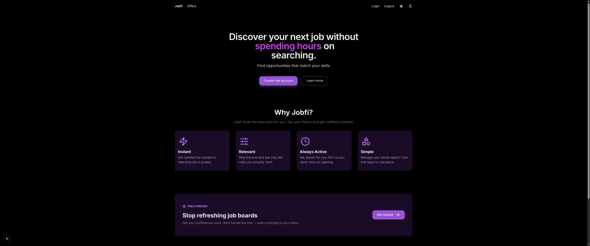
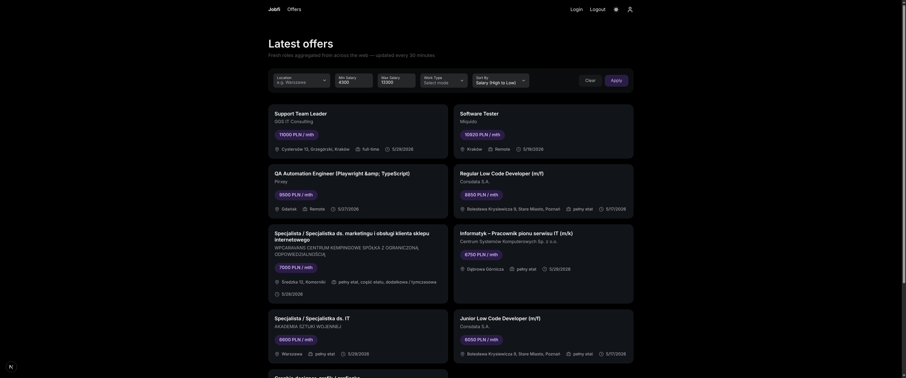
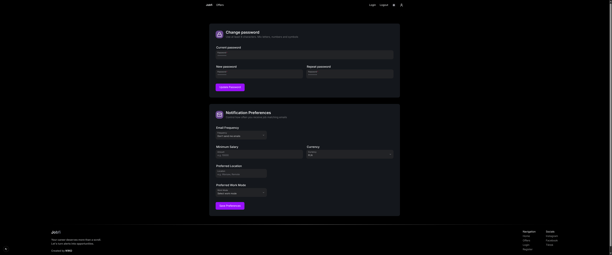

# 🚀 Jobfi

<p align="center">
  <strong>Personalized job alerts delivered straight to your phone</strong>
</p>

<p align="center">
  
  
  
  
</p>

---

## 📋 Table of Contents

- [About](#-about)
- [Screenshots](#-screenshots)
- [Tech Stack](#-tech-stack)
- [Getting Started](#-getting-started)
- [Environment Variables](#-environment-variables)
- [Running the Project](#-running-the-project)
- [Project Structure](#-project-structure)
- [Features](#-features)

---

## 🎯 About

Jobfi is a smart job aggregation platform that automatically scrapes job listings from Polish job boards (**JustJoinIt** and **Pracuj.pl**), matches them against your preferences, and delivers personalized notifications via email.

**Key highlights:**
- 🔍 Automated hourly job scraping from multiple sources
- 📧 Daily/weekly email notifications with matched jobs
- 🎛️ Customizable preferences (salary, location, tech stack, work mode)
- 🔐 Secure JWT authentication with email verification
- 🌙 Modern dark-mode UI

---

## 📸 Screenshots

<div align="center">


*Landing Page*


*Job Offers with Filters*


*User Profile & Preferences*

</div>

---

## 🛠️ Tech Stack

### Frontend
| Technology | Purpose |
|------------|---------|
| **Next.js 15** | React framework with App Router & Server Actions |
| **TypeScript** | Type-safe development |
| **Tailwind CSS 4** | Utility-first styling |
| **HeroUI** | Modern component library |
| **Wretch** | Lightweight HTTP client |

### Backend
| Technology | Purpose |
|------------|---------|
| **FastAPI** | High-performance async API |
| **Python 3.13** | Backend runtime |
| **SQLAlchemy** | Async ORM with SQLModel |
| **Alembic** | Database migrations |
| **APScheduler** | Background job scheduling |
| **Patchright** | Stealth browser automation for scraping |
| **Brevo API** | Transactional email delivery |

### Infrastructure
| Technology | Purpose |
|------------|---------|
| **PostgreSQL 17** | Primary database |
| **Docker Compose** | Container orchestration |
| **Uvicorn** | ASGI server |

---

## 🚀 Getting Started

### Prerequisites

- **Docker & Docker Compose** (recommended)
- Or **Node.js 22+** and **Python 3.13+** for local development

### 1. Clone the Repository

```bash
git clone https://github.com/your-username/Jobfi.git
cd Jobfi
```

### 2. Set Up Environment Variables

```bash
cp .env.example .env
```

Edit `.env` and configure your secrets (see [Environment Variables](#-environment-variables)).

---

## ⚙️ Environment Variables

| Variable | Description | Example |
|----------|-------------|---------|
| `POSTGRES_USER` | Database username | `postgres` |
| `POSTGRES_PASSWORD` | Database password | `your_secure_password` |
| `POSTGRES_DB` | Database name | `jobfiDB` |
| `DB_HOST` | Database host | `db` |
| `DB_PORT` | Database port | `5432` |
| `SECRET_KEY` | JWT signing key | `your_random_secret_key` |
| `ALGORITHM` | JWT algorithm | `HS256` |
| `ACCESS_TOKEN_EXPIRE_MINUTES` | Token expiry | `30` |
| `NEXT_PUBLIC_API_URL` | Backend API URL | `http://localhost:8080/` |
| `BREVO_API_KEY` | Brevo email API key | `your_brevo_api_key` |

---

## 🏃 Running the Project

### Option A: Docker (Recommended)

```bash
docker compose up --build
```

This starts:
- **Frontend** → http://localhost:3000
- **Backend API** → http://localhost:8080
- **PostgreSQL** → localhost:5432

### Option B: Local Development

**Backend:**
```bash
cd backend

# Install dependencies
uv sync

# Install browser for scraping
uv run patchright install --with-deps chromium

# Run database migrations
uv run alembic upgrade head

# Start the server
uv run uvicorn app.main:app --host 0.0.0.0 --port 8080 --reload
```

**Frontend:**
```bash
cd frontend

# Install dependencies
npm ci

# Start dev server
npm run dev
```

---

## 📁 Project Structure

```
Jobfi/
├── backend/
│   ├── app/
│   │   ├── models/          # SQLAlchemy models (User, JobOffer, Preference)
│   │   ├── routers/         # API endpoints (auth, offers, preferences)
│   │   ├── services/        # Business logic (auth, emails, notifications)
│   │   ├── repositories/    # Database queries
│   │   ├── scrapers/        # Job board scrapers (JustJoinIt, Pracuj.pl)
│   │   └── core/            # Database config
│   ├── migrations/          # Alembic migrations
│   └── templates/emails/    # Jinja2 email templates
│
├── frontend/
│   ├── app/
│   │   ├── auth/            # Login, Register, Verify, Reset Password
│   │   ├── offers/          # Job listings with filters
│   │   ├── profile/         # User preferences & settings
│   │   └── about/           # How it works page
│   └── components/          # Reusable UI components
│
├── docker-compose.yml
└── .env.example
```

---

## ✨ Features

- **Automated Scraping** — Hourly job scraping from JustJoinIt and Pracuj.pl
- **Smart Matching** — Jobs matched against your salary, location, and tech preferences
- **Email Notifications** — Daily or weekly digest of matching jobs
- **Advanced Filtering** — Filter by salary, work mode, location, and sort results
- **Secure Authentication** — JWT with email verification and password reset
- **Dark Mode** — Modern UI with theme switching

---

## 📄 License

This project is open source and available under the [MIT License](LICENSE).

---

<p align="center">
  Made with ❤️ for job seekers
</p>
